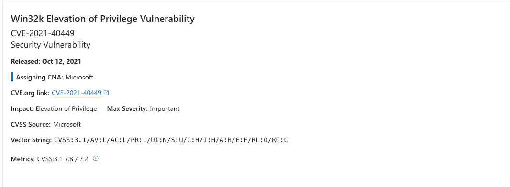

<!-- @import "[TOC]" {cmd="toc" depthFrom=1 depthTo=6 orderedList=false} -->

<!-- code_chunk_output -->

- [Win32k Elevation of Privilege Vulnerability](#win32k-elevation-of-privilege-vulnerability)
- [1. 漏洞效果-EoF](#1-漏洞效果-eof)
- [2. 漏洞影响](#2-漏洞影响)
- [3. 漏洞原理](#3-漏洞原理)
- [4. 漏洞利用](#4-漏洞利用)
- [5. 参考资料](#5-参考资料)

<!-- /code_chunk_output -->

## Win32k Elevation of Privilege Vulnerability

## 1. 漏洞效果-EoF

成功利用可以实现本地权限提升。

## 2. 漏洞影响
Windows 10 Version 1809 32-bit Systems, x64-based Systems, ARM64-based Systems affected from 10.0.0 before 10.0.17763.2237 etc.
https://www.cve.org/CVERecord?id=CVE-2021-40449

## 3. 漏洞原理
内核提权0 day 漏洞。该漏洞与Windows 窗口管理和图形化设备接口相关（Win32kfull.sys），可以被利用于将Windows 下较低级别权限的用户权限提升为系统权限（user->system）。

该漏洞产生的原因是win32kfull!GreResetDCInternal 函数存在缺陷：当在用户模式下执行ReserDC 函数并执行系统调用NtGdiResetDC 及其内部函数GreResetDCInternal，此函数获取指向PDC 对象的指针，但在函数内部未检查该对象是否已经被释放，导致可以对一个格式错误的PDC 对象以某种方式进行利用实现堆任意内核函数的调用。
## 4. 漏洞利用

https://github.com/ly4k/CallbackHell

## 5. 参考资料
https://twitter.com/RedDrip7/status/1450743401641431048
https://msrc.microsoft.com/update-guide/en-US/advisory/CVE-2021-40449