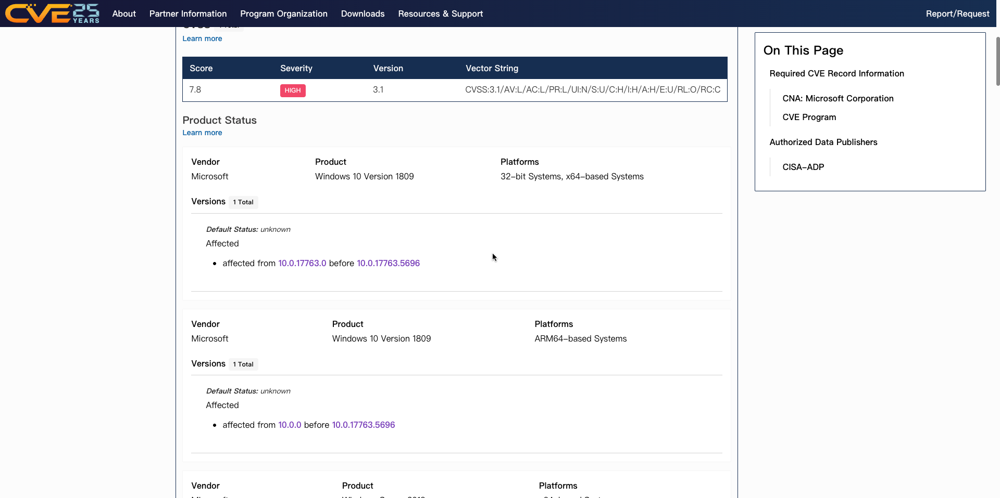
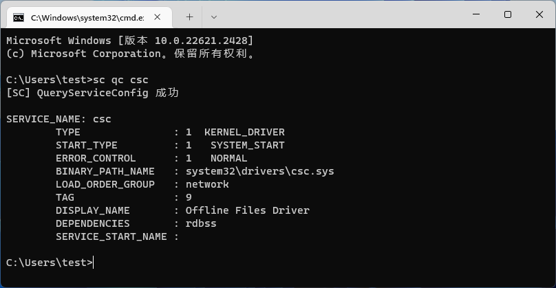
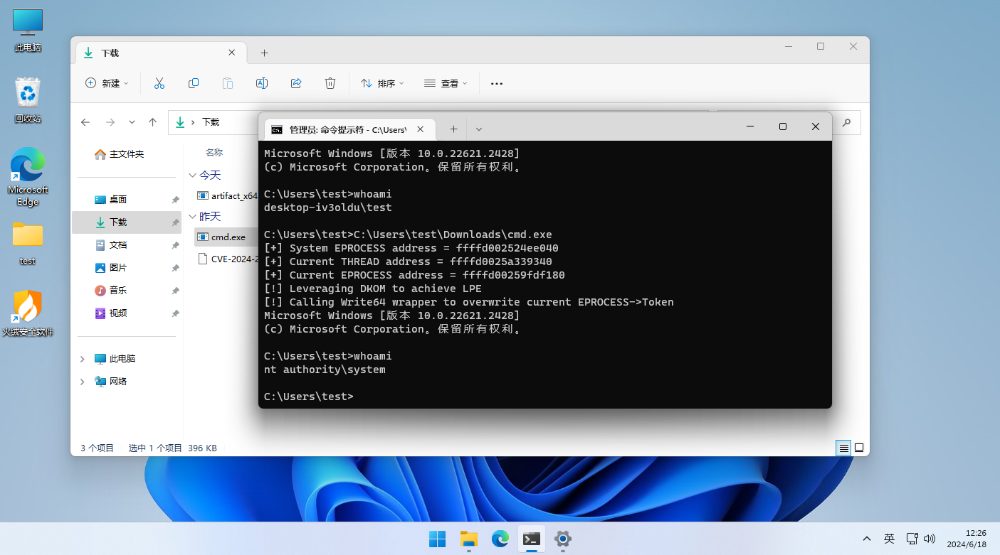

<!-- @import "[TOC]" {cmd="toc" depthFrom=1 depthTo=6 orderedList=false} -->

<!-- code_chunk_output -->

- [Windows CSC Service Elevation of Privilege Vulnerability](#windows-csc-service-elevation-of-privilege-vulnerability)
- [1. 漏洞效果-EoF](#1-漏洞效果-eof)
- [2. 漏洞影响](#2-漏洞影响)
- [3. 漏洞原理](#3-漏洞原理)
- [4. 漏洞利用](#4-漏洞利用)
- [5. 参考资料](#5-参考资料)

<!-- /code_chunk_output -->

## Windows CSC Service Elevation of Privilege Vulnerability

## 1. 漏洞效果-EoF

本质上，攻击者可以编写触发溢出的恶意代码或输入，从而控制受影响的系统、执行任意命令、安装恶意软件或访问敏感数据。 微软已发出警告成功利用此漏洞的攻击者可以获得 SYSTEM 权限，这是 Windows 系统上的最高访问级别。

## 2. 漏洞影响
Windows 10 Version 1809 32-bit Systems, x64-based Systems affected from 10.0.17763.0 before 10.0.17763.5696 

Windows 10 Version 1809 ARM64-based Systems affected from 10.0.0 before 10.0.17763.5696 

https://www.cve.org/CVERecord?id=CVE-2024-26229

利用条件：需要主机开启csc服务，使用如下命令查询，显示SYSTEM_START即为开启。

## 3. 漏洞原理
该漏洞属于：CWE-122: Heap-based Buffer Overflow

Windows CSC服务特权提升漏洞。 当程序向缓冲区写入的数据超出其处理能力时，就会发生基于堆的缓冲区溢出，从而导致多余的数据溢出到相邻的内存区域。这种溢出会损坏内存，并可能使攻击者能够执行任意代码或未经授权访问系统。本质上，攻击者可以编写触发溢出的恶意代码或输入，从而控制受影响的系统、执行任意命令、安装恶意软件或访问敏感数据。 微软已发出警告成功利用此漏洞的攻击者可以获得 SYSTEM 权限，这是 Windows 系统上的最高访问级别。这增加了与 CVE-2024-26229 相关的风险，使其成为恶意行为者的主要目标。

## 4. 漏洞利用

https://github.com/RalfHacker/CVE-2024-26229-exploit
https://github.com/varwara/CVE-2024-26229
https://github.com/apkc/CVE-2024-26229-BOF

POC编译：使用Visual Studio编译，采用Mtd多线程调试。静态编译。

Tested On：系统版本为Windows 11专业版 22H2(22621.2428)，提权成功

## 5. 参考资料
https://msrc.microsoft.com/update-guide/vulnerability/CVE-2024-26229
https://www.cnblogs.com/CVE-Lemon/p/18254117